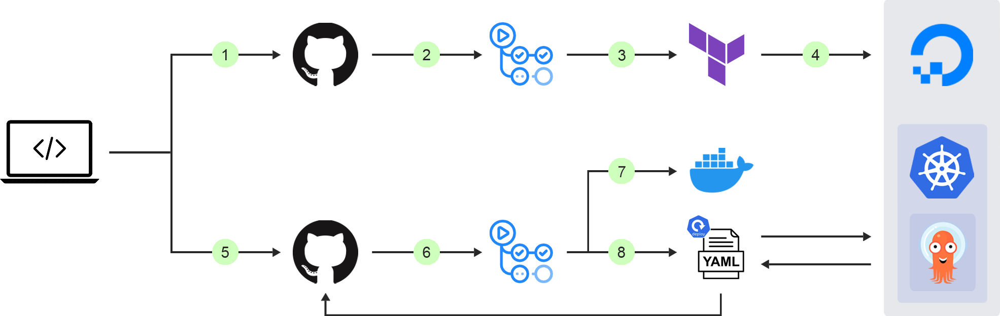
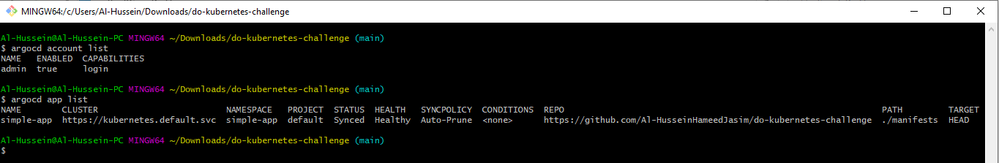
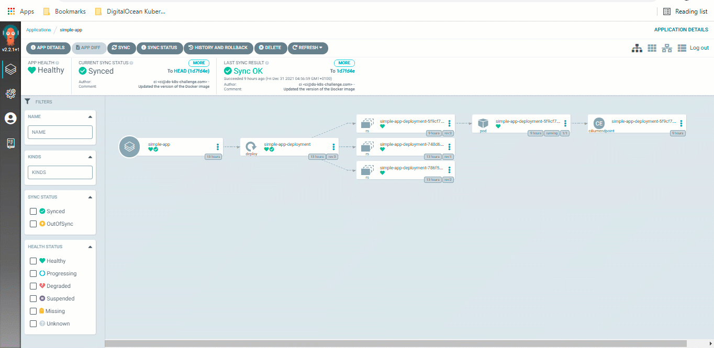

# Simple TCP port tester written in NodeJS with CI/CD workflow
This repository is based on https://github.com/Al-HusseinHameedJasim/do-kubernetes-challenge repos.



Architecturel diagram

## Continuous Integration (CI)
To automate the application build process, I have set up a workflow that builds the Docker image and pushes it to Docker Hub. <br>
This workflow also bumps the version of the Docker image in the Kubernetes deployment manifest using [sed](https://www.baeldung.com/linux/sed-substitution-variables#:~:text=sh%0AMY_DATE%3D%24(date)-,sed%20%2Di%20%2Dr%20%22s/%5E(CURRENT_TIME%20%3D).*/%5C1%20%24MY_DATE/%22%20test.txt,-Now%2C%20let%E2%80%99s%20test) upon a successful [merge of a Pull Request](https://github.community/t/trigger-workflow-only-on-pull-request-merge/17359/9) (PR) into the main branch. <br>
This is particularly important for the GitOps approach given that the GitOps agent monitors the git repository as the single source of truth and synchronizes the desired state into the Kubernetes cluster.

## Continuous Delivery (CD)
To continuously deploy the latest version of the application into the Kubernetes cluster, I have used Argo CD, a widely used open-source GitOps operator for Kubernetes.
> GitOps is a set of principles, practices, and tools to manage infrastructure and application delivery using a developer-friendly tool, Git.

#### Access Argo CD
To [log in](https://github.com/bitnami/charts/blob/master/bitnami/argo-cd/templates/NOTES.txt#:~:text=echo%20%22Password%3A%20%24(kubectl%20%2Dn%20%7B%7B%20.Release.Namespace%20%7D%7D%20get%20secret%20argocd%2Dsecret%20%2Do%20jsonpath%3D%22%7B.data.clearPassword%7D%22%20%7C%20base64%20%2Dd)%22) to Argo CD server:
```
export password=$(kubectl -n argocd get secret argocd-secret -o jsonpath="{.data.clearPassword}" | base64 -d)
argocd login $serverUrl --username=admin --password=$password
```

#### Deploy an application
Once logged in, it becomes feasible to deploy an application using Argo CD. To do so, I have configured an application in a yaml manifest and have run the following Argo CD CLI command to create it:
```
argocd app create -f argocd/simple-app.yaml
```
To check the application status using Argo CD CLI:



It is also possible to use the UI as shown in the gif below:



Argo CD updates the application once a new version has been released, i.e. the Docker image version in the deployment manifest has been updated when a PR gets merged.
